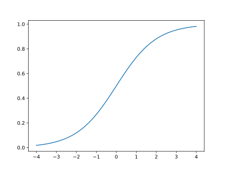
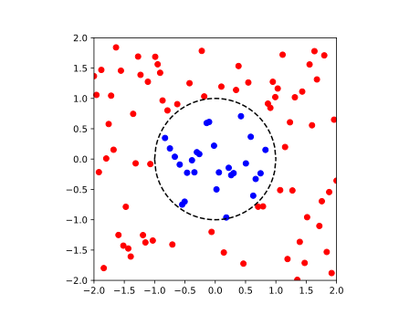

# 逻辑回归

## 逻辑回归

机器学习不仅仅是应用在数据预测上，还能应用在逻辑问题上，譬如说，回答一副照片是否是一只猫，回答一个数字是否大于1等等。这就要求机器给出的回答是‘是’或者’否‘，‘0’或者‘1’这样。可以定义一个函数 $f(x)$ ，然后定义一个阈值 $s$ ，一般取 $0.5$ ,如果函数值大于阈值，那么输出‘是’，否则输出‘否’,可以用如下控制语句表示：

```python
def f(x)：
  #选择合适的函数
x=input()
if f(x)>0.5 :
  print('是')
else:
  print('否‘)
```

通常，我们选择一个名为‘逻辑函数’的函数：

$$
g(z)=\frac{1}{1+e^{-z}} 
$$


它的图像大致是这样的：


 
如何在机器学习中应用它呢？我们可以在其中带入各种函数，例如：

$$
\begin{aligned}
&z=&w&x&+b \\
&z=&w&x^2&+b 
\end{aligned}
$$

## 决策边界

上一小节说的阈值，对应的 $z$ 就是决策边界。 $g(z)=0.5$ ,可以解得 $z=0$ 。在这个边界的两侧，对应着不同的回答，即机器不同的决策。

现在，举例说几个更为复杂的决策边界，在二维参数空间中，数据如图所示，不同颜色的点代表不同的决策。



这幅图中，横坐标为参数 $x_1$ ,纵坐标为参数 $x_2$ ,很明显，两种不同颜色的点（不同的决策），有一个明显的边界：

$$
x_1^2+x_2^2=1
$$

再考虑椭圆的情况，很容易想到，对于这类情况，应该取 $z= w_1x_1^2+w_2x_2^2+b$ 。于是得到

$$
f(x)=\frac{1}{1+e^{-(w_1x_1^2+w_2x_2^2+b)}} 
$$

当然，还能有更多的组合，这里不一一介绍了。

## 损失（代价）函数

对于逻辑函数，如果简单地取和线性模型一样的损失函数，根据普遍的认知，这个损失函数存在多个局部最小值，很容易使得参数’困在‘局部最小值而无法达到全局最小值。

一般来说，可以取这样的损失函数：

$$
J(\omega,b)=\frac{1}{2m} \sum_{i=1}^{m}( -y^{(i)}log(f(x^{(i)}))-(1-y^{(i)})log(1-f(x^{(i)})) )
$$


