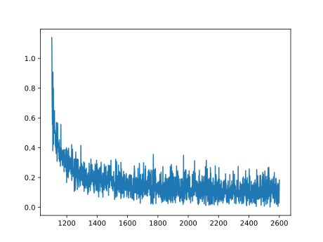
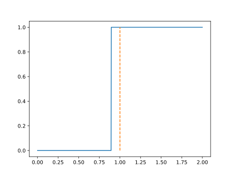

简单逻辑回归的尝试，取1000个随机数，范围为 $(0,2)$ ，用逻辑回归判断，这个数是否大于1


```python
import torch as t
import random
```

第一步，取随机数


```python
x=t.tensor([random.random()*2 for _ in range(100)])
y=t.tensor([1 if i >1 else 0 for i in x])
```

接下来，设置参数


```python
w=t.ones(2,dtype=t.float)
w.requires_grad_(True)
w.grad
```

数据选择器


```python
def selector(x,y,num,le):
    r=t.randint(0,le,(num,))
    return x[r],y[r]
```

损失函数


```python
def loss(y,y_hat):
    return -y*t.log(y_hat)-(1-y)*t.log(1-y_hat)
```

更新函数


```python
def update(w,lr):
    with t.no_grad():
        w-=lr*w.grad
        w.grad.zero_()
```

模型


```python
def f(x,w):
    return 1/(1+t.exp(-(w[0]*x+w[1])))
```

开始训练


```python
num_data=10
times=100
lr=0.3
for _ in range(times):
    X,Y=selector(x,y,num_data,len(x))
    l=loss(Y,f(X,w))/num_data
    l.sum().backward()
    update(w,lr)
    m.append(m[-1]+1)
    n.append(l.sum().detach().numpy())
print(*w.detach().numpy())
print(l.sum().detach().numpy())   
```

    7.3582973 -6.5783844
    0.015510451


```python
m=[0]
n=[0]
```


```python
plt.plot(m[1:],n[1:])
```


 

    

    


测试一下模型的准确度


```python
import numpy as np
```


```python
def f_t(x):
    if f(x,w)>0.5:
        return 1
    else:
        return 0
```


```python
x_t=np.linspace(0,2,1000)
y_t=[]
for i in x_t:
    y_t.append(f_t(i))
```


```python
plt.plot(x_t,y_t)
plt.plot(np.ones(100),np.linspace(0,1,100),"--")
```


    

    

