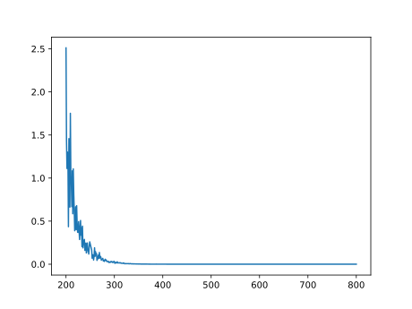
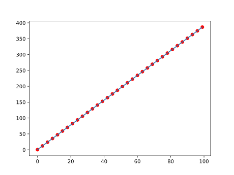

```python
import torch as t
```


```python
import matplotlib.pyplot as plt
```

根据方程 $y=kx+b$ 生成一组数据


```python
x=t.arange(0,100,1,dtype=t.float)
y=3.9*x+0.4
```

正则化


```python
def normal(x):
    a=x.max()
    x/=x.max()
    return a
a=normal(x)
```

参数


```python
w=t.ones(2,dtype=t.float)
w.requires_grad_(True)
w.grad
```

拟合方程


```python
def f(x,w):
    return w[0]*x+w[1]
```

设计一个数据选择器


```python
def selector(x,num,le):
    r=t.randint(0,le,(num,))
    return x[r],y[r]
```

设计一个cost/loss


```python
def loss(y,y_hat):
    return (y-y_hat)**2/2
```

更新函数


```python
def update(w,lr):
    with t.no_grad():
        w-=lr*w.grad
        w.grad.zero_()
```

开始训练

```python
m=[0]
n=[0]
```

```python
num_data=10
times=100
lr=0.3
for _ in range(times):
    X,Y=selector(x,num_data,len(x))
    l=loss(Y,f(X,w))/num_data
    l.sum().backward()
    update(w,lr)
    m.append(m[-1]+1)
    n.append(l.sum().detach().numpy())
print(w[0]/a,w[1])
```

    tensor(3.9000, grad_fn=<DivBackward0>) tensor(0.4001, grad_fn=<SelectBackward0>)


```python
plt.plot(m[200:],n[200:])
```

损失函数图像

    

    
最终效果

```python
plt.plot(x[::3]*a,y[::3],'ro')
plt.plot(x[::3]*a,(w[0]*x+w[1]).detach().numpy()[::3])
```


