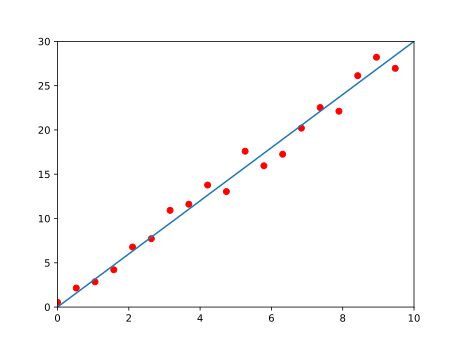
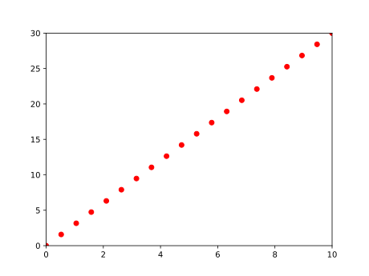
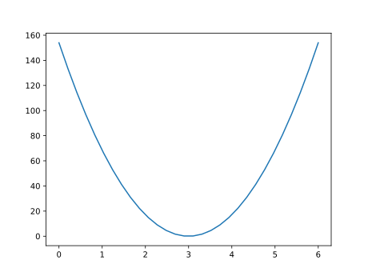

# 线性模型和代价函数

## 线性模型

对于 $m$ 个离散的点 $(x^{(i)},y^{(i)})$ ，我用模型 $y=f(x)=\omega x+b$ 来拟合这些点，即找到合适的 $\omega$ 和 $b$ ,使得方程 $y=\omega x+b$ 能够更精确的描述数据。

## 代价函数

如期所述，我们需要找到合适的 $\omega$ 和 $b$ （参数）,什么样的 $\omega$ 和 $b$ 是我们需要的呢？我们需要找到一个能够描述 $\omega$ 和 $b$ 合适程度的量。对于线性拟合，可以定义

$$
J(\omega,b)=\frac{1}{2m} \sum_{i=1}^{m}(f(x^{(i)})-y^{(i)})^2
$$

这个 $J(\omega,b)$ 最小时， $\omega$ 和 $b$ 就是最合适的。这是我们耳熟能详的最小二乘法拟合，这也是最简单的有监督机器学习模型。

### 代价函数可视化

简单来看，不考虑 $b$ 时，我们需要的模型为 $y=f(x)=\omega x$ ，代价函数即为 $J(\omega)$ 。此时，当输入数据满足 $y=3 x$ 时，数据大概是这样的分布。

代价函数应该是一个开口向上的二次函数（如果输入数据没有那么好，它的形状会丑一些）。

我们只要找到这个函数的最低点，就能知道最合适的参数了。如果考虑 $b$ ，那么这个代价函数的图像应该和一个墨西哥帽一样。当然，代价函数还可以喝更多参数有关，即它可以是更多元的函数，此时它的图像应该是一个高纬空间的几何图形。
